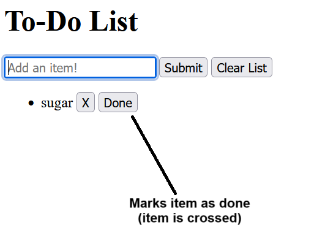

Shopping/To Do List - Project

- Website to create a shpping or To Do list, made as part of a group project to apply HTML, CSS, but mainly JavaScript skills.

- Wireframes made with Balsamiq software

Mobile view: 

Tablet view: 

Laptop/Desktop view: 

Final view: 

After adding item to list: 

- Main features: (add screenshot for each feature)
  - Add a new item to the list
  

  - Deleting an item from the list
  

  - Marking an item has done/bought by applying line over item
   

  - Clearing the full list
  

User stories:

  1 - New item (must-have):
  User Story: I like to go shopping and find it hard to have a paper list with me, would like to have an app or site on my mobile that I can use to to add a new to-do item to the list, and see all the things I want to buy.
  
  Acceptance criteria:
  - Showing different items that the user has added to the list
  - Allow the user to add more items to the list
  
  Tasks:
  - Create an input text to write new items
  - Create a button to add items to the list
  
  2 - Clear input field (should-have):
  User story: As a user, I want to clear the text I enter into the input field, so that I can clear the text quickly.
  
  Acceptance criteria:
  - Ability to clear text in text input box
  
  Tasks:
  - Function to clear textbox
  - Add Clear button to call function

  3 - Good Design (could-have):
  User Story: To Do List should be easy to see and use.
  
  Acceptance criteria:
  - Create checkboxes so that users can easily see them
  - Color-code items by importance so that users can easily see them
  
  Tasks:
  - Create checkboxes.
  - Decide on colors according to importance to make them easier to understand.

  4 - Mark item as done (could-have):
  User story: As a user, I want to mark a to-do item as done so that I know which tasks have been completed.

  Acceptance Criteria:
  - The to-do item should look different from the other list items .e.g format is strikethrough
  - Done button should disappear once item is marked done.

  Tasks:
  - Create a Done button
  - Change font style to strikethrough
  - Hide Done button

  5 - Delete to-do item (could-have):
  User Story: I would like to be able to remove an item from my list if I realize I still have this item at home.

  Acceptance criteria:
  - Being able to remove item from the list created initially
  - List being updated automatically as user removes item from list
  - Item can be removed from Unordered list without reordering other list items
  
  Tasks:
  - Ability to remove item from list

User stories review: all stories were completed, apart from the clear input field as the input field with clear automatically after submitting an item and the cursor will beready to write a new item, so a specific button is not needed.The objective was achieved in a different way, still effective and providing a good user experience without the need for extra buttons.
  
- Members of the group: Tripta, Tomoko, Carlos 
